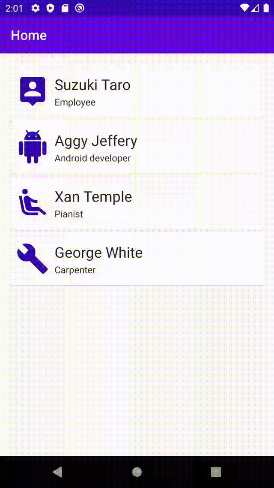

# AndroidFeatureExample

This project is my sample project for Android.

## Features

- Multi module
- MVVM
- Coroutine
- Navigation
- Palette API

### Palette API

Changing window status bar color by header image.

[Android developer - Palette API を使用した色の選択](https://developer.android.com/training/material/palette-colors?hl=ja)

## Author

yasukotelin

## LICENCE

MIT LICENCE
